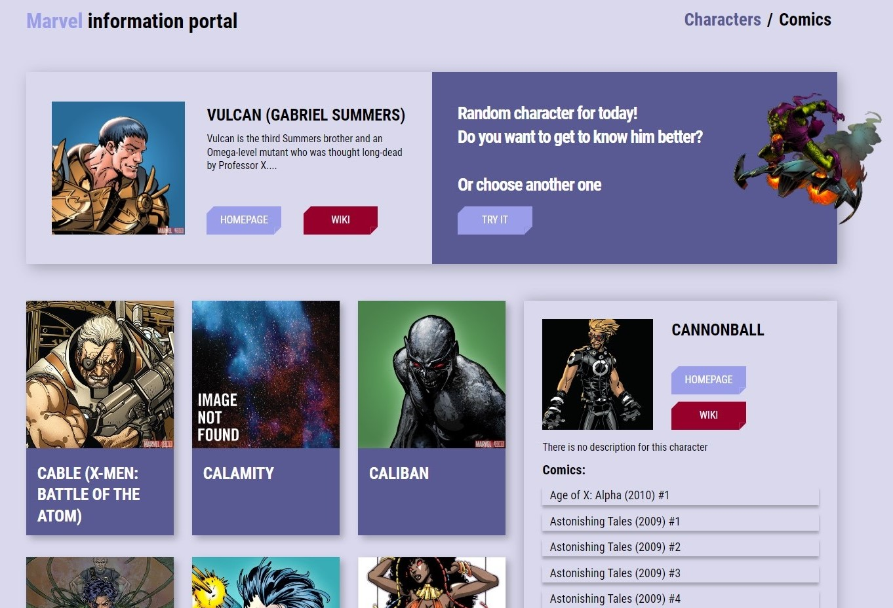
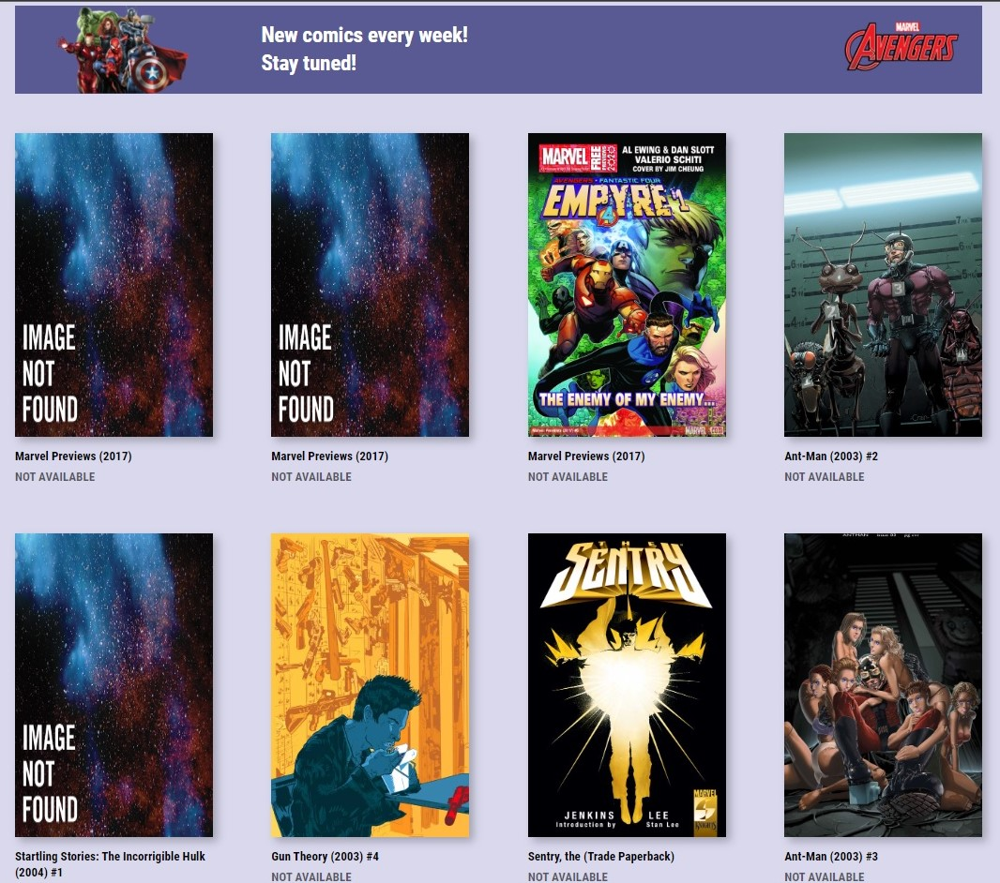

# Marvel Information Portal

🦸 An application created with the React library, as well as using the Marvel API.



💣The portal provides up-to-date information about the favorite characters of the Marvel Universe, as well as about the comics where these characters appear.



## Features/highlights

-   the application is written mainly in functional components (with the exception of ErrorBoundary)
-   states in components are stored locally
-   for routing, the react-router-dom v.6.1.0 library is used
-   individual pages are generated dynamically

## Setup

```bash
$ git clone https://github.com/YuriyDubinin/marvel-information-portal.git
$ cd marvel-information-portal
$ npm i
$ npm start
```

## Build

```bash
$ npm build
```
